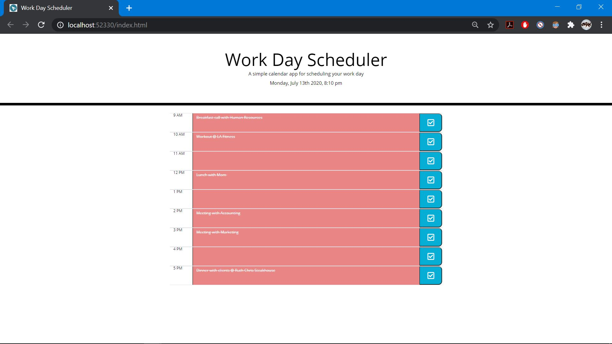

# Work-Day-Scheduler

This project showcases an interactive web-app that aims to be user friendly and responsive. By including moment.js at the top of the page the user can find an automatically up to date display of the current date and time. Below this header section the user will find nine time blocks meant to illustrate the typical work day. Within these nine blocks the user can plan out their day by inputting whatever information they like and then selecting the "Check" button to save that input. What makes this application the most interesting is the use of colors to impact the schedule. If the current time is before a time block, it will appear green. If the current time is during a time block, it will appear white. Lastly, if the current time is after a time block, it will appear red. Any text the user has written in a time block that is currently red will still be visible, but will be accented with a white line through it. To visit the deployed application please click here: https://chandler8.github.io/Work-Day-Scheduler/

## User Story

```
AS AN employee with a busy schedule
I WANT to add important events to a daily planner
SO THAT I can manage my time effectively
```

## Images




